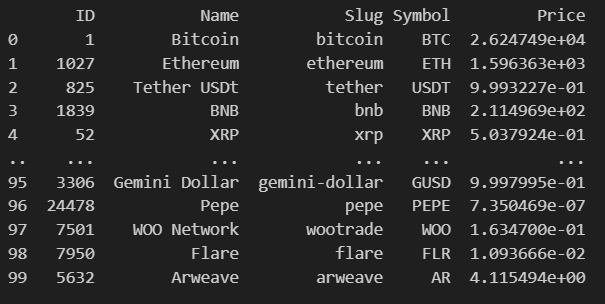
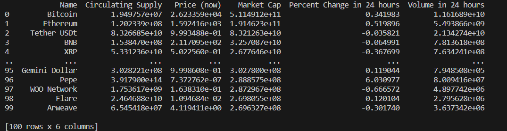
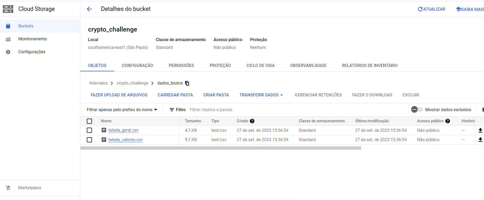
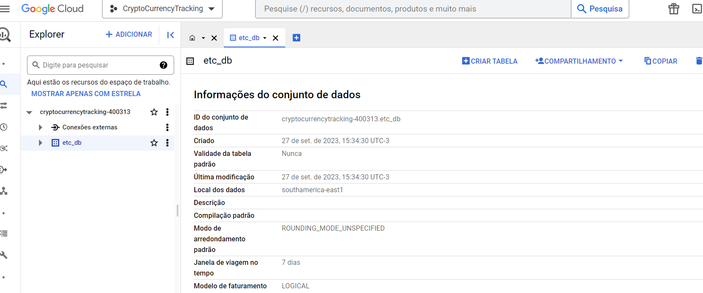
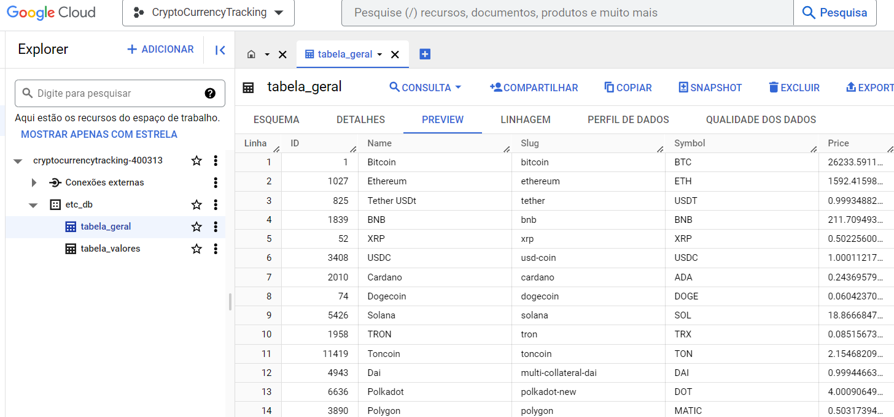
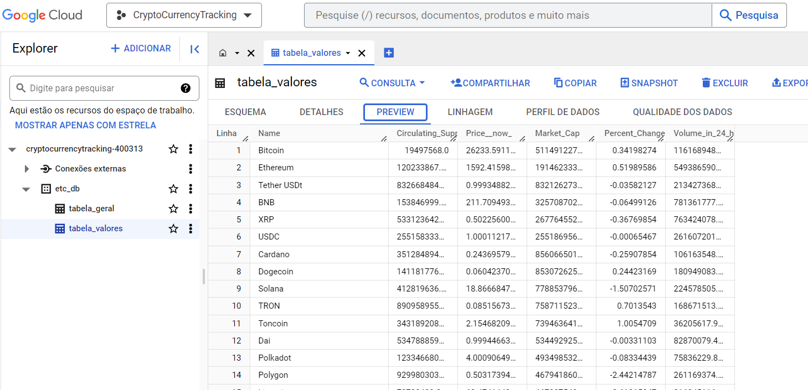

# Desafio Técnico - Cadastra

O desafio técnico consiste na coleta e armazenamento de dados de criptomoedas, cujo qual servirá, principalmente, para avaliar as habilidades técnicas na linguagem de programação Python, a capacidade analítica, o conhecimento em boas práticas de programação e a habilidade na manipulação de dados. O objetivo principal é desenvolver um programa que consuma dados de uma API de criptomoedas e os armazene em um banco de dados.

## Descrição do desafio:

O desafio consiste em criar uma aplicação Python que seja capaz de acessar uma API pública de criptomoedas, como o Crypto Market Cap, para extrair informações relevantes sobre diversas criptomoedas disponíveis no mercado. O programa deve ser capaz de coletar dados, como preços, capitalização de mercado, volume de negociação e outras métricas relevantes.

## Arquitetura planejada para o desafio:

- Conexão com a API utilizando Python;
- Download dos dados obtidos pela API;
- Conversão dos dados para dataframe utilizando Pandas;
- Conversão dos dataframes para csv utilizando Pandas;
- Criação de um bucket no Cloud Storage do GCP;
- Carregamento dos dados trazidos pela API e convertidos para csv para o bucket do Cloud Storage do GCP;
- Criação de um banco de dados no BigQuery do GCP;
- Criação de tabelas no banco de dados criado, utilizando os dados em csv que foram carregados no bucket;
- Criação de esquemas para as tabelas.

Ao final, sugerir futuras implantações e melhorias para o projeto, como por exemplo, chatbot com LLM, web app, etc.

## Primeiro passo - Conexão com a API:

O primeiro passo consiste em conectar com a API do Crypto Market Cap e puxar os dados necessários dela e, para isso, criamos uma conta gratuita para uso básico no mesmo, o qual nos fornecerá uma "key" individual para a API. Com a nossa key em mãos, podemos, utilizando Python, puxar os dados da API, seguindo o código sugerido pela documentação do Crypto Market Cap (https://coinmarketcap.com/api/documentation/v1/) e adaptando-o para o nosso uso.
Devemos salvar os dados sensíveis de acesso a API, como a nossa key individual, em um arquivo separado, que aqui, se chamará "config.py", pois é uma medida de segurança que previne que indivíduos mal intencionados utilizem da key individual da conta.

## Ingestão dos dados:

Ingerimos, a partir da API da Crypto Market Cap, os dados das 100 criptomoedas com mais movimentações no presente momento da ingestão dos dados.
Usamos a biblioteca Python chamada Pandas para convertermos os dados, que foram ingeridos em formato json, para o formato dataframe, o que nos facilitará imensamente o trabalho de manipulação dos dados.
Separaremos os dados em 2 dataframes diferentes, o primeiro sendo um dataframes mais geral, com os dados das 100 criptomoedas com mais movimentações e o segundo contendo alguns valores mais específicos, como porcentagem de flutuação de valor num período de 24 horas das mesmas 100 criptomoedas com mais movimentações, por exemplo. 

Vamos converter os dataframes para csv, o que nos facilitará mais tarde, ao mexermos no GCP.

## Criação das tabelas:

Criaremos as tabelas usando serviços do Google Cloud Plataform, especificamente, neste momento, o Cloud Storage.
Primeiro criamos um Bucket, que armazenará os nossos dados na nuvem para, posteriormente, esses mesmos dados serem usados por outros serviços do GCP.
Com isso, fazemos o upload dos arquivos csv, que são os dataframes antes confeccionados.

Agora, criamos, no BigQuery, uma base de dados para armazenarmos nossas tabelas, chamada etc_db:

Com o banco de dados criado, podemos criar as tabelas finais, clicando em "Criar tabela" no banco de dados criado. Logo em seguida, seleciona-se a opção "Google Cloud Storage" e depois procura-se os arquivos csv que foram carregados no bucket.

Usaremos a opção "Editar texto" na parte de "Esquema", pois, gerar automaticamente um Esquema pode nos trazer problemas futuros, como permitir que o usuário coloque valores nulos onde não poderia ser possível tal ato, por exemplo.

Com isso, criamos as tabelas "tabela_geral" e "tabela_valores" contendo, respectivamente, informações gerais das 100 criptomoedas mais movimentadas e informações mais específicas das mesmas.

Para um volume de dados como esse, isto é, bem baixo, podemos fazer essa análise olhando uma por uma, mas, caso estivéssemos trabalhando com Big Data ou mesmo com banco de dados mais extensos, precisaríamos ser mais generalistas e fazer os tratamentos mais comuns e gerais que são empregados na engenharia de dados, como por exemplo: exclusão de arquivos NULL, exclusão de arquivos falsos ou com erros grotescos, modificação de simbologia de números (geralmente mudando de , para .), entre outros.

## Sugestão de futuras implementações e melhorias:

Seguem algumas sugestões de implemetações e melhorias para esse projeto, para que, num futuro, seja mais completo e entregue mais valor:
  - Uma aplicação web interativa, que permitam várias análises do usuário a partir dos dados que foram incluídos na tabela_geral e tabela_valores;
  - Um chatbot automatizado com langchain que responda questões, como um ChatGPT, sobre os dados contidos na tabela_geral e tabela_valores;
  - Um dashboard no Looker, contendo diversas informações, gráficos interativos e insights sobre os dados na tabela_geral e tabela_valores. 
